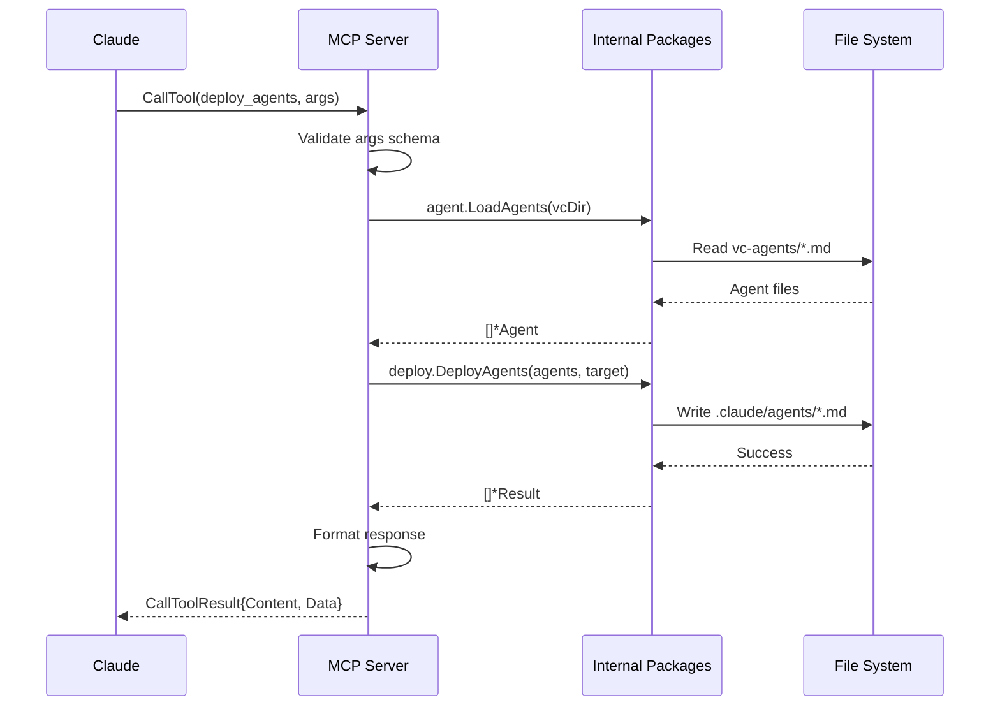

<!--
AI-Generated Documentation
Created by: mcp-specialist
Date: 2025-10-05
Purpose: CAMI MCP Server Architecture Overview
-->

# CAMI MCP Server Architecture

## Overview

The CAMI MCP (Model Context Protocol) server exposes CAMI's agent management capabilities through a standardized protocol interface, enabling seamless integration with Claude Code and other MCP-compatible clients.

**Server Name**: `cami`
**Version**: `0.1.0`
**Transport**: stdio (standard input/output)
**Language**: Go
**SDK**: github.com/modelcontextprotocol/go-sdk v1.0.0

## Architecture Diagram

```
┌─────────────────────────────────────────────────────────────┐
│                     Claude Code Client                       │
└────────────────────────┬────────────────────────────────────┘
                         │ MCP Protocol (stdio)
                         │ JSON-RPC 2.0
                         │
┌────────────────────────▼────────────────────────────────────┐
│                   CAMI MCP Server                            │
│  ┌───────────────────────────────────────────────────────┐  │
│  │              Tool Handler Layer                        │  │
│  │  • deploy_agents                                       │  │
│  │  • update_claude_md                                    │  │
│  │  • list_agents                                         │  │
│  │  • scan_deployed_agents                                │  │
│  └──────────────────────┬─────────────────────────────────┘  │
│                         │                                     │
│  ┌──────────────────────▼─────────────────────────────────┐  │
│  │         CAMI Internal Package Integration              │  │
│  │  ┌─────────┐  ┌─────────┐  ┌─────────┐  ┌──────────┐  │  │
│  │  │  agent  │  │  deploy │  │  docs   │  │ discovery│  │  │
│  │  │ package │  │ package │  │ package │  │ package  │  │  │
│  │  └─────────┘  └─────────┘  └─────────┘  └──────────┘  │  │
│  └────────────────────────────────────────────────────────┘  │
└─────────────────────────┬───────────────────────────────────┘
                          │
                          │ File System Operations
                          │
┌─────────────────────────▼───────────────────────────────────┐
│                   File System Layer                          │
│  • vc-agents/          (source agents)                       │
│  • .claude/agents/     (deployed agents)                     │
│  • CLAUDE.md           (documentation)                       │
└──────────────────────────────────────────────────────────────┘
```

## Component Breakdown

### 1. Server Initialization

The server initializes with:
- **Name**: "cami"
- **Version**: "0.1.0"
- **VC Agents Directory Detection**:
  - Environment variable: `CAMI_VC_AGENTS_DIR`
  - Working directory: `./vc-agents`
  - Executable directory: `{exec_dir}/vc-agents`

### 2. Tool Registration

Each tool is registered with the MCP SDK using typed handlers:

```go
mcp.AddTool(server, &mcp.Tool{
    Name:        "tool_name",
    Description: "Detailed description for Claude",
}, handlerFunction)
```

The SDK automatically:
- Generates JSON schema from Go struct tags
- Validates input parameters
- Handles type conversion
- Returns structured responses

### 3. Internal Package Integration

The MCP server acts as a thin protocol layer over CAMI's internal packages:

| Package | Purpose | Used By Tools |
|---------|---------|---------------|
| `agent` | Load and parse agent files | all tools |
| `deploy` | Deploy agents to projects | deploy_agents |
| `docs` | Update CLAUDE.md files | update_claude_md |
| N/A | Scan deployed agents | scan_deployed_agents |

### 4. Request/Response Flow



## Error Handling

The server implements comprehensive error handling:

1. **Parameter Validation**: JSON schema validation via SDK
2. **Path Validation**: Target path existence and accessibility checks
3. **Agent Validation**: Agent name verification against available agents
4. **Operation Errors**: Deployment conflicts, file I/O errors
5. **Structured Errors**: All errors returned as JSON-RPC error responses

## Logging Strategy

- **Target**: stderr (stdout reserved for MCP protocol)
- **Format**: Standard Go log format with timestamps
- **Levels**: Info (startup), Error (failures)
- **Startup Log**: VC agents directory location

## Transport Mechanism

**stdio Transport**:
- Input: stdin (JSON-RPC requests from Claude)
- Output: stdout (JSON-RPC responses)
- Logs: stderr (server diagnostics)

This allows the server to be launched as a child process by Claude Desktop, with bidirectional communication over standard streams.

## Configuration

### Environment Variables

| Variable | Purpose | Default |
|----------|---------|---------|
| `CAMI_VC_AGENTS_DIR` | Location of version-controlled agents | Auto-detected |

### Auto-Detection Logic

1. Check `CAMI_VC_AGENTS_DIR` environment variable
2. Try `{working_directory}/vc-agents`
3. Try `{executable_directory}/vc-agents`
4. Fail if not found

## Security Considerations

1. **Path Validation**: All target paths validated before operations
2. **Conflict Detection**: Existing files not overwritten without explicit flag
3. **Error Sanitization**: Internal paths not exposed in errors
4. **Read-Only Access**: VC agents directory accessed read-only
5. **No Network**: Server operates entirely locally

## Performance Characteristics

- **Agent Loading**: O(n) where n = number of agent files
- **Deployment**: O(m) where m = number of agents to deploy
- **Scanning**: O(n) for comparing deployed vs available agents
- **Memory**: Loads all agent metadata into memory (typically <1MB)

## Extension Points

Future enhancements could include:

1. **Resource Providers**: Expose agent files as MCP resources
2. **Prompt Templates**: Agent deployment workflow prompts
3. **Progress Notifications**: Long-running deployment feedback
4. **Caching**: Agent metadata caching for performance
5. **Batch Operations**: Multi-project deployment support
